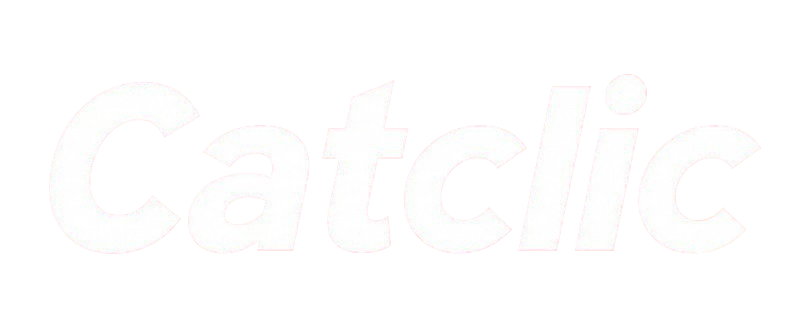
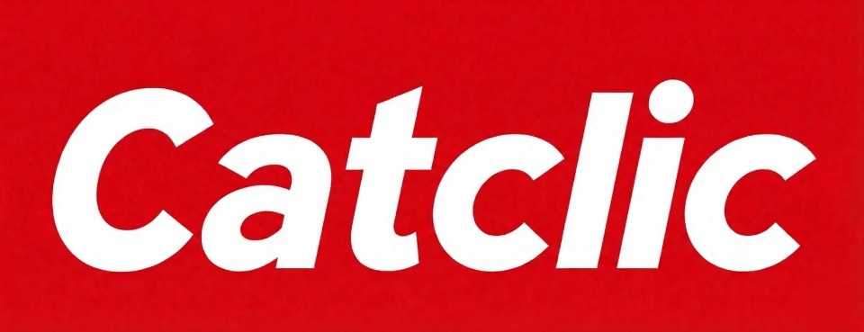
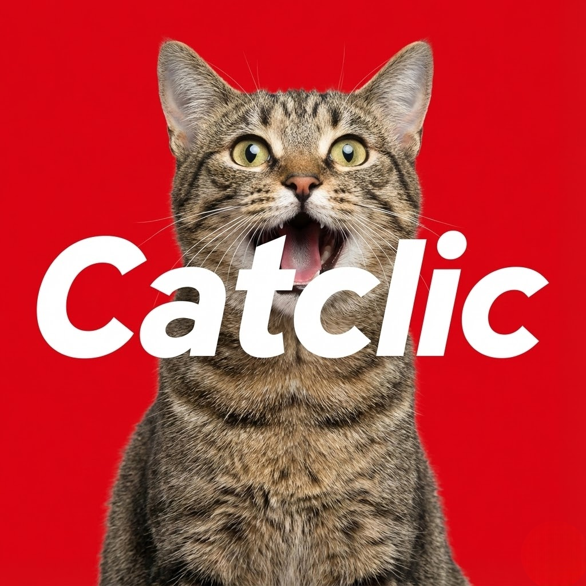

#  Catclic - Your Intelligent Betclic Assistant



**Catclic** to inteligentny asystent, który automatyzuje proces wyszukiwania zakładów, analizuje mecze przy użyciu **Google Gemini AI** i pomaga unikać pętli oraz błędów poznawczych. Zbudowany z myślą o bezpieczeństwie i efektywności.

> [!TIP]
> **Strona projektu:** [catclic.tech](https://catclic.tech)

---

## 🚀 Główne Funkcje (Key Features)

| Funkcja | Opis |
| :--- | :--- |
| **🤖 Smart Auto-Picker** | Inteligentny algorytm nawiguje po ligach, wyszukuje zakłady i automatycznie skleja kupony. |
| **🧠 Gemini AI Core** | Silnik oparty na Google Gemini analizuje statystyki, H2H i formę, sugerując najlepsze typy. |
| **🛡️ Bezpieczna Nawigacja** | Symulacja zachowań ludzkich (losowe czasy, "chłodzenie") dla ochrony konta. |
| **⚡ Błyskawiczne Kupony** | Jedno kliknięcie, aby znaleźć okazje i dodać je do betslipu. |

---

## 🛠️ Instalacja (Installation)

1. **Pobierz Repozytorium**
   Sklonuj ten projekt lub pobierz jako ZIP.
   ```bash
   git clone https://github.com/YourUsername/Betclic.git
   ```

2. **Przygotuj Rozszerzenie**
   Wejdź do katalogu `extension` i zainstaluj zależności:
   ```bash
   cd extension
   pnpm install
   pnpm build
   ```

3. **Załaduj w Chrome**
   - Otwórz `chrome://extensions`
   - Włącz **Tryb dewelopera** (prawy górny róg).
   - Kliknij **Załaduj rozpakowane**.
   - Wybierz folder `extension/build/chrome-mv3-prod`.

---

## 🎮 Jak to działa? (How it works)

### 1. Automatyzacja
Algorytm przeszukuje dostępne mecze, filtrując je według zadanych kryteriów. Omija mecze, które mogą powodować pętle.

### 2. Analiza AI
Gdy wybierzesz mecz, Gemini AI przetwarza dane historyczne i statystyczne, by dostarczyć predykcję z uzasadnieniem.

### 3. Egzekucja
Wybrane zakłady trafiają na Twój kupon - szybko i skutecznie.

---

## 🏗️ Technologia (Stack)

- **Frontend / Extension**:<br/>
  
  
  

- **AI Core**:<br/>
  

- **Backend / Analytics**:<br/>
  

---

<div align="center">
  
  <br/>
  <sub>Narzędzie nieoficjalne. Hazard uzależnia. Graj odpowiedzialnie. 18+</sub>
</div>
